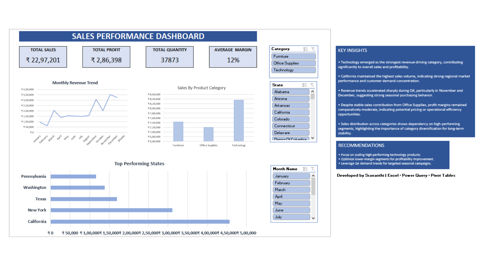

# 📊 Sales Performance Dashboard

Interactive Sales Performance Dashboard built using Excel, Power Query, Pivot Tables, Pivot Charts, and Slicers.

## 📌 Project Overview

This project analyzes sales data and transforms raw business data into actionable insights using **Microsoft Excel**, **Power Query**, **Pivot Tables**, **Pivot Charts**, and **Slicers**.

The dashboard helps stakeholders monitor sales performance, profitability, category contribution, and regional trends through interactive visualizations.

---

## 🎯 Business Problem

Organizations generate large amounts of sales data every day. However, raw transactional data alone cannot support effective decision-making.

The goal of this project was to:

* Convert raw sales data into meaningful business insights
* Identify revenue and profit trends
* Analyze category-wise performance
* Evaluate regional sales contribution
* Create an interactive dashboard for business reporting

---

## 📂 Dataset Description

The dataset contains sales transaction records with the following key fields:

| Column     | Description          |
| ---------- | -------------------- |
| Order Date | Date of transaction  |
| Sales      | Revenue generated    |
| Profit     | Profit earned        |
| Quantity   | Number of units sold |
| Category   | Product category     |
| State      | Sales region         |

---

## 🧹 Data Cleaning & Transformation

Data preprocessing was performed using **Power Query**.

### Transformations Applied

✔ Corrected data types

✔ Created Month column

✔ Created Year column

✔ Created Quarter column

✔ Calculated Profit Margin

✔ Prepared analysis-ready dataset

---

## 📈 Key Performance Indicators (KPIs)

The dashboard tracks the following metrics:

* Total Sales
* Total Profit
* Quantity Sold
* Profit Margin

---

## 📊 Dashboard Preview

---

## 📌 Dashboard Components

### Monthly Sales Trend

* Visualizes revenue movement over time
* Helps identify seasonal patterns

### Category-wise Sales Analysis

* Compares sales across product categories
* Identifies top-performing categories

### Regional Performance Analysis

* Highlights top contributing states
* Supports geographical decision-making

### Interactive Slicers

Users can dynamically filter data based on:

* Category
* State
* Month

---

## 💡 Key Business Insights

### Insight 1

Technology category contributed significantly to overall sales revenue.

### Insight 2

California generated the highest sales among all states.

### Insight 3

Sales performance improved during Q4, indicating strong seasonal demand.

---

## 🛠 Tools & Technologies Used

| Tool         | Purpose                        |
| ------------ | ------------------------------ |
| Excel        | Data Analysis                  |
| Power Query  | Data Cleaning & Transformation |
| Pivot Tables | Data Aggregation               |
| Pivot Charts | Visualization                  |
| Slicers      | Interactive Filtering          |

---

## 📁 Project Files

* Sales_Performance_Dashboard.xlsx
* dashboard_preview.png

---

## 🚀 Skills Demonstrated

* Data Cleaning
* Data Transformation
* Dashboard Development
* KPI Reporting
* Business Intelligence
* Data Visualization
* Analytical Thinking

---

## 👩‍💻 Author

**Sravanthi**

Aspiring Data Analyst | Business Analyst | Data Science Enthusiast
